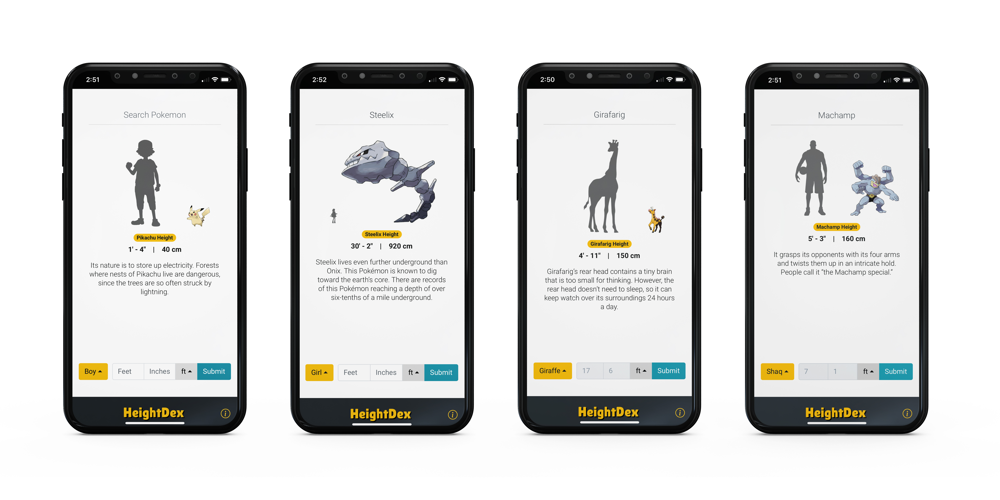

# HeightDex

HeightDex is a pokemon-inspired project that fetches data from the PokeAPI and allows you to to compare your own height against other pokemons at scale. There are also a couple other comps like Shaq and

### Screenshots

